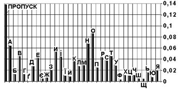
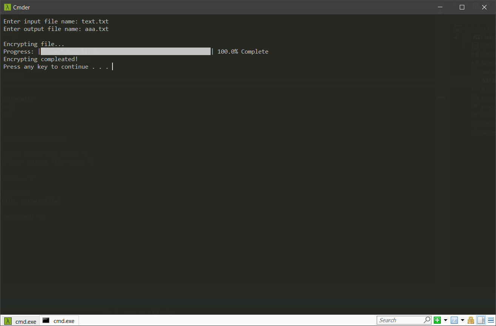

# 
__Лабораторна робота № 2__

---

#### __Тема: Гомофонний шифр: процедура шифрування__

#### __Мета: отримати навики практичної реалізації процедури шифрування для гомофонного шифру.__

__1)__	використовуючи наведені на рис. 2 дані про частоту літер в українській мові, запропонувати свою таблицю пропорційної заміни; пропуск вважати як ще одну додаткову літеру алфавіту; числа у таблиці використовувати або усі двоцифрові, або усі трицифрові;

Program for encrypting:
<a href="files/AZI_lab_1_encrypt.py" download>Go to My Code</a>

Program for decrypting:
<a href="files/AZI_lab_1_decrypt.py" download>Go to My Code</a>

__2)__	програмно реалізувати процедуру шифрування для шифру пропорційної заміни, використовуючи свою таблицю; (я вирішив використати словник, де ключем буде буква, а значенням буде список з 2-цифрових чисел, що відповідають цій букві)

Program for encrypting:
<a href="files/AZI_lab_2" download>Go to My Code</a>

File with my table:
<a href="files/table.txt" download>Go to text file</a>

__3)__	написати текст про місцевість, у якій живуть батьки (довжиною біля 100 літер – відкритий текст; пробіли можна використовувати; розділові знаки та цифри не використовувати), і записати його у файл відкритого тексту;

<a href="files/text.txt" download>Go to text file</a>

__4)__	зашифрувати цей текст шифром пропорційної заміни; вихідний текст (криптограму) записати у файл, який буде використовуватися у лабораторній роботі №3;

File with encrypted text:
<a href="files/aaa.txt" download>Go to text file</a>

__5)__	підготувати опис/звіт про виконану роботу.
