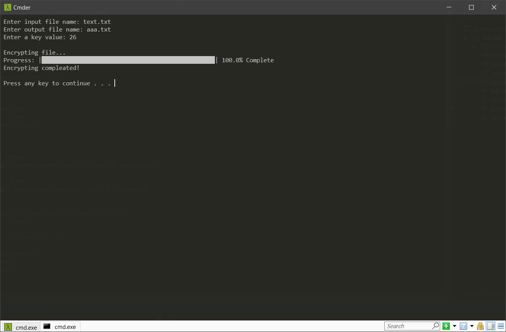
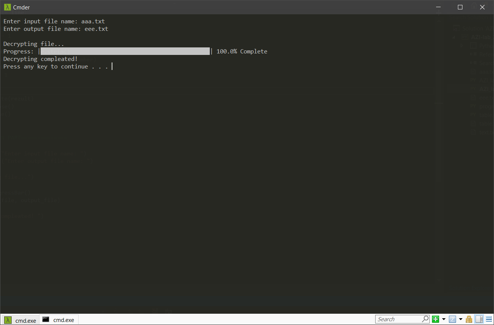
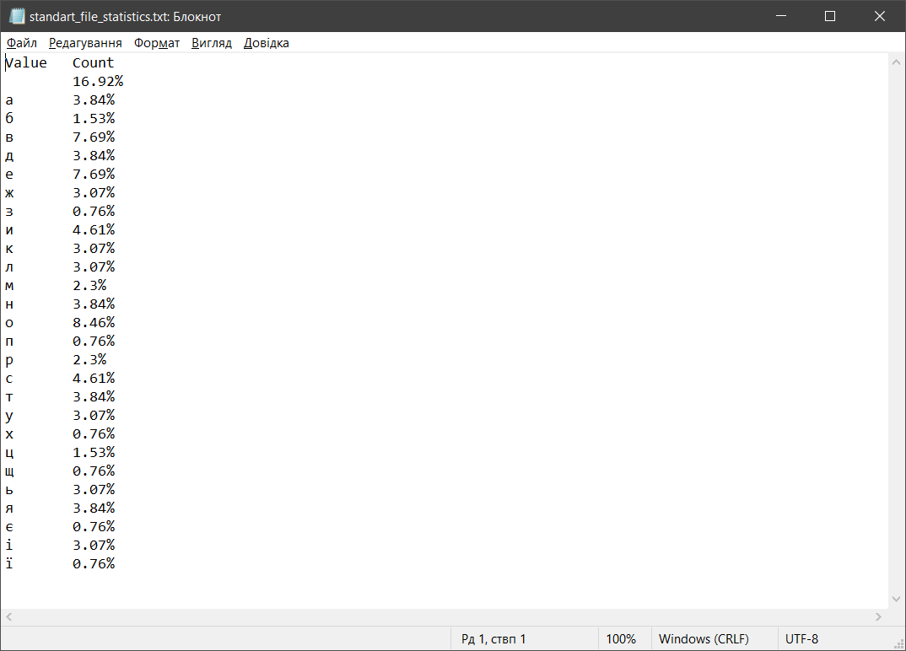
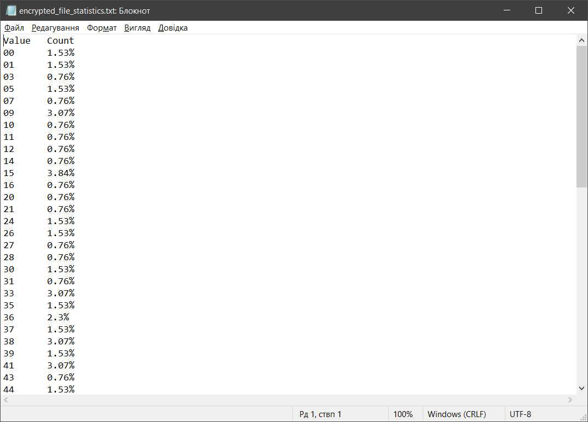

# 
__Лабораторна робота № 3__

---

### __Тема: Гомофонний шифр: процедура дешифрування__

### __Мета: отримати навики практичної реалізації процедури дешифрування для гомофонного шифру.__

__1)__	використовуючи наведені на рис. 2 дані про частоту літер в українській мові, запропонувати свою таблицю пропорційної заміни; пропуск вважати як ще одну додаткову літеру алфавіту; числа у таблиці використовувати або усі двоцифрові, або усі трицифрові;

---

__2)__	використовуючи файл зі своєю криптограмою з лабораторної № 2, дешифрувати інформацію про місцевість, у якій живуть Ваші батьки; результат записати у файл відкритого тексту;

Program for decrypting:
<a href="files/AZI_lab-3.py" download>Go to My Code</a>

File with my table:
<a href="files/table.txt" download>Go to text file</a>

File with encrypted text:
<a href="files/aaa.txt" download>Go to text file</a>

---

__3)__	перевірити правильність кінцевого тексту (тексту, який пройшов процедури шифрування і дешифрування).

File with decrypted text:
<a href="files/eee.txt" download>Go to text file</a>

---

__4)__	проаналізуйте частоту символів у відкритому тексті та у криптограмі у вигляді табл. 2 та табл. 3; ці частоти повинні суттєво відрізнятися.

Statistics from standart file:
<a href="files/standart_file_statistics.txt" download>Go to text file</a>

---

Statistics from encrypted file:
<a href="files/encrypted_file_statistics.txt" download>Go to text file</a>

---

__5)__	підготувати опис/звіт про виконану роботу.
