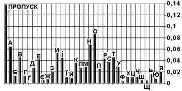
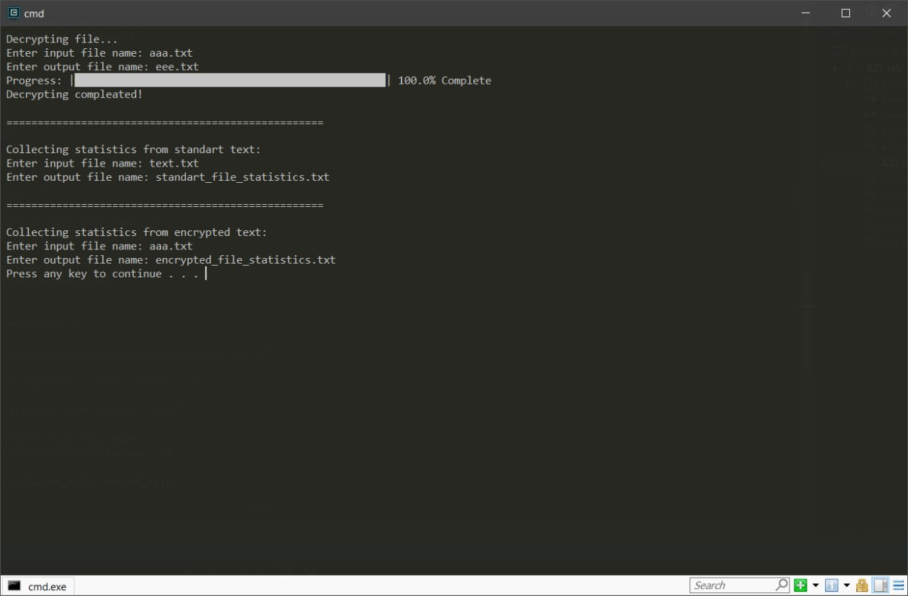

# 
__Лабораторна робота № 1__

---

#### __Тема: Шифр зсуву. Процедури шифрування та дешифрування__

#### __Мета: отримати навики практичної реалізації процедур шифрування та дешифрування шифром зсуву.__

__1)__	програмно реалізувати шифр зсуву для української абетки (процедуру шифрування та дешифрування);

Program for encrypting:
<a href="files/AZI_lab_1_encrypt.py" download>Go to My Code</a>

Program for decrypting:
<a href="files/AZI_lab_1_decrypt.py" download>Go to My Code</a>

__2)__	написати текст про вулицю, на якій живете (довжиною понад 100 символів – відкритий текст; розділові знаки та пробіли не використовувати) і записати його у файл;

My text:
<a href="files/text.txt" download>Go to text file</a>

__3)__	прочитати відкритий текст з файлу і зашифрувати його шифром зсуву; як ключ використовувати дату свого народження (наприклад, якщо студент народився 17 лютого, то використовує ключ n = 17); результат записати у файл;

File with encrypted text:
<a href="files/aaa.txt" download>Go to text file</a>

__4)__	дешифрувати цю криптограму з метою отримання відкритого тексту;

File with decrypted text:
<a href="files/eee.txt" download>Go to text file</a>

__5)__	підготувати опис/звіт про виконану роботу.
