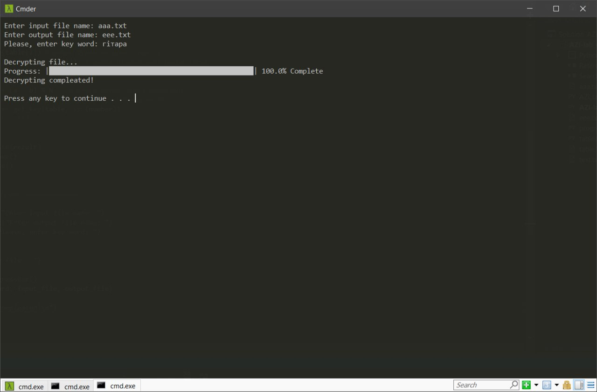

# 
__Лабораторна робота № 4__

---

#### __Тема: Шифр модульного гамування: процедури шифрування та дешифрування__

#### __Мета: отримати навики практичної реалізації процедур шифрування та дешифрування для шифру модульного гамування.__

__1)__	використовуючи українську абетку запропонувати свій варіант реалізації шифру модульного гамування;

My table:
<a href="files/table.txt" download>Go to file with my table</a>

---

__2)__	програмно реалізувати процедуру шифрування;

Program for encrypting:
<a href="files/AZI-lab_4_encrypt.py" download>Go to my code</a>

---

__3)__	запропонувати свій текст про кафедру прикладної математики, довжиною понад 100 літер і записати його у файл

File with  text:
<a href="files/text.txt" download>Go to text file</a>

---

__4)__	зашифрувати відкритий текст; як парольну фразу використати слово чи фразу, що означає Ваше хобі (без пробілів, апострофів і т.д.); результат шифрування записати у файл;

File with encrypted text:
<a href="files/aaa.txt" download>Go to text file</a>

---

__5)__ програмно реалізувати процедуру дешифрування; дешифрувати отриману в попередньому завданні криптограму з використанням тієї самої гами і пересвідчитися, що отримано початковий відкритий текст;

Program for decrypting:
<a href="files/AZI-lab_4_decrypt.py" download>Go to my code</a>

File with decrypted text:
<a href="files/eee.txt" download>Go to text file</a>

---

__6)__	підготувати опис/звіт про виконану роботу.
