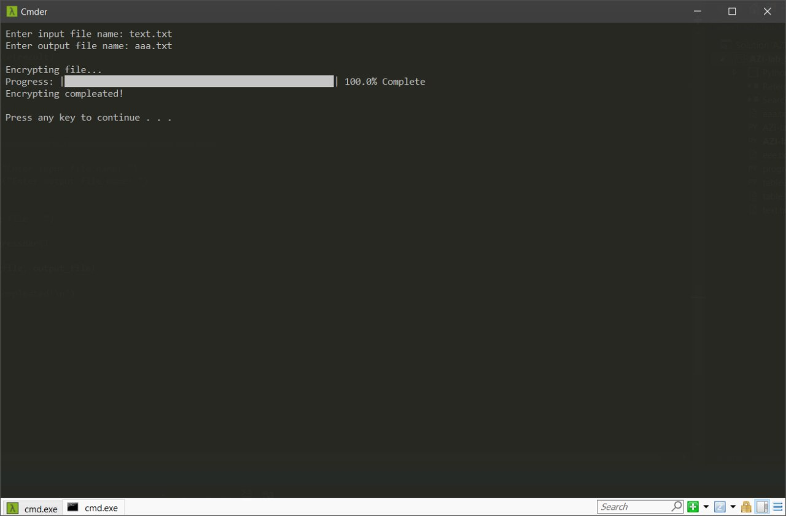

# 
__Лабораторна робота № 5__

---

#### __Тема: Шифр Плейфера: процедура шифрування__

#### __Мета: отримати навики практичної реалізації процедури шифрування для шифру Плейфера__

---
__1)__	запропонувати свою таблицю-ключ для реалізації шифру Плейфера для текстів українською мовою;

My table:
<a href="files/table.txt" download>Go to text file</a>

---

__2)__	програмно реалізувати процедуру шифрування, використовуючи свою таблицю-ключ;

Program for encrypting:
<a href="files/AZI-lab_5_encrypt.py" download>Go to My Code</a>

---

__3)__	написати свій текст про любимий напиток (довжиною понад 100 літер – відкритий текст) і записати його у файл відкритого тексту; зашифрувати цей текст шифром Плейфера;

File with my text:
<a href="files/text.txt" download>Go to text file</a>

---

__4)__	вихідний текст (криптограму) записати у файл, який буде використовуватися у лабораторній роботі №6;

File with encrypted text:
<a href="files/aaa.txt" download>Go to text file</a>

---

__5)__	підготувати опис/звіт про виконану роботу.
