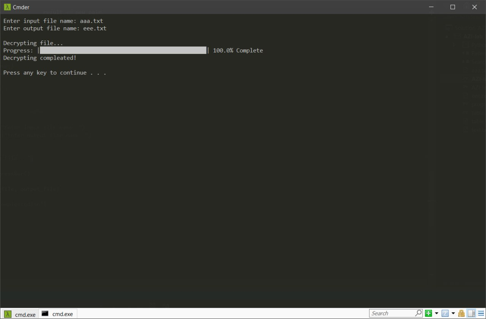

# 
__Лабораторна робота № 6__

---

#### __Тема: Шифр Плейфера: процедура дешифрування__

#### __Мета: отримати навики практичної реалізації процедури дешифрування для шифру Плейфера__

---

__1)__	програмно реалізувати процедуру дешифрування шифром Плейфера, використо-вуючи свою, запропоновану у лабораторній роботі №5, таблицю-ключ;

My table:
<a href="files/table.txt" download>Go to text file</a>

File with encrypted text:
<a href="files/aaa.txt" download>Go to text file</a>

Program for decrypting:
<a href="files/AZI-lab_5_decrypt.py" download>Go to My Code</a>

---

__2)__	дешифрувати криптограму, отриману у результаті виконання лабораторної роботи №5, і перевірити чи отримано правильний відкритий текст про свій любимий напиток

File with deecrypted text:
<a href="files/eee.txt" download>Go to text file</a>

---

__3)__	підготувати опис/звіт про виконану роботу.
